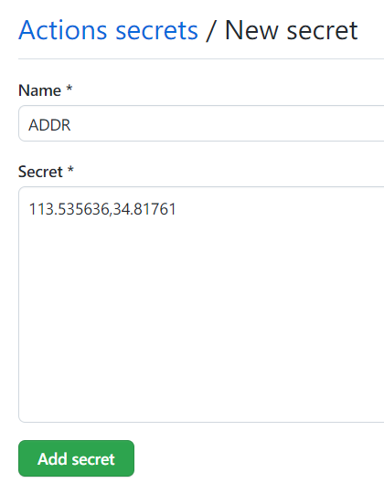
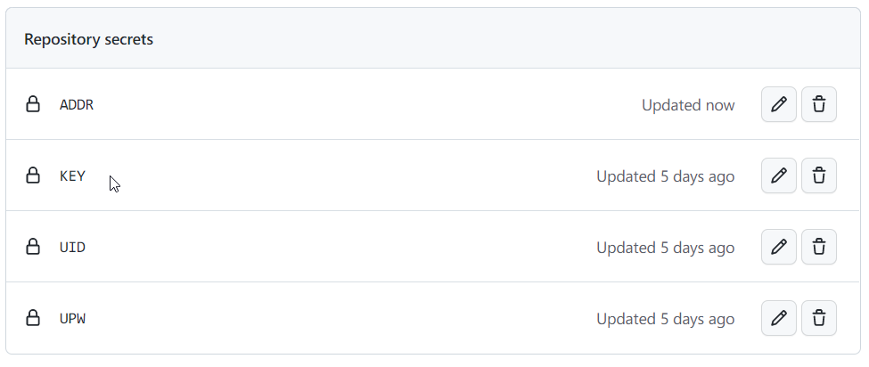
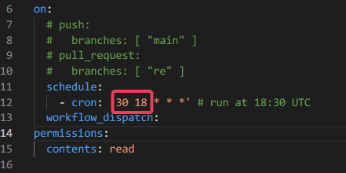
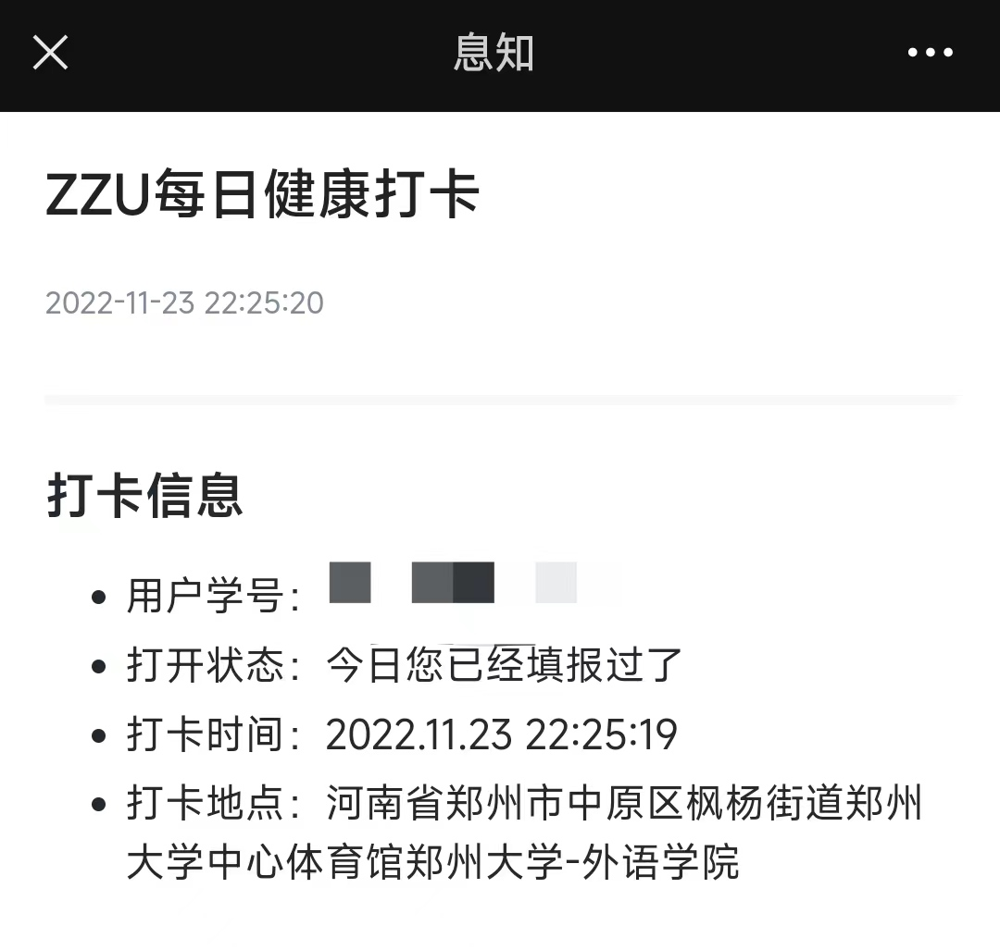

# 郑州大学健康上报


> 声明：本项目为Python学习交流的开源非营利项目，仅作为程序员之间相互学习交流之用。严禁用于商业用途，禁止使用本项目进行任何盈利活动。使用者请遵从相关政策。对一切非法使用所产生的后果，我们概不负责。本项目对您如有困扰请联系我们删除。

## 公告

> 仓库持续更新，欢迎star，关注动态
>
> 首次使用请参考[Github Actions](https://github.com/yunke120/zzu-jksb#3-github-actions%E6%8E%A8%E8%8D%90)，已经`fork`过仓库的小伙伴请[更新](https://github.com/yunke120/zzu-jksb#%E5%85%B6%E4%BB%96)仓库，[贡献](https://github.com/yunke120/zzu-jksb#%E5%85%B6%E4%BB%96)代码请细读本文件

2022年11月23日：打卡地点可通过添加环境变量`ADDR`来修改，`ADDR`为你所要打卡地点的[经纬度](https://lbs.amap.com/demo/javascript-api/example/geocoder/regeocoding)值，更多信息请参考以下说明。


## 一、参数说明

`submit_data.json`参数说明

| 序号 | 参数名称     | 可选值            | 说明                                                 |
| ---- | ------------ | ----------------- | ---------------------------------------------------- |
| 1    | myvs_1       | 是；否            | 您今天是否有发热症状                                 |
| 2    | myvs_2       | 是；否            | 您今天是否有咳嗽症状                                 |
| 3    | myvs_3       | 是；否            | 您今天是否有乏力或轻微乏力症状                       |
| 4    | myvs_4       | 是；否            | 您今天是否有鼻塞、流涕、咽痛或腹泻等症状             |
| 5    | myvs_5       | 是；否            | 您今天是否被所在地医疗机构确定为确诊病例             |
| 6    | myvs_7       | 是；否            | 您是否被所在地政府确定为密切接触者                   |
| 7    | myvs_8       | 是；否            | 您是否被所在地政府确定为次密切                       |
| 8    | myvs_11      | 是；否            | 您今天是否被所在地医疗机构进行院内隔离观察治疗       |
| 9    | myvs_12      | 是；否            | 您今天是否被要求在政府集中隔离点进行隔离观察         |
| 10   | myvs_13      | 是；否            | 您今日是否被所在地政府有关部门或医院要求居家隔离观察 |
| 11   | myvs_15      | 是；否            | 共同居住人是否有确诊病例                             |
| 12   | **myvs_13a** | 默认41            | 当前实际所在地（若出差填写出差地）省份(自治区)       |
| 13   | **myvs_13b** | 默认4101          | 地市                                                 |
| 14   | **myvs_13c** | 默认科学大道100号 | 填写详细位置                                         |
| 15   | myvs_24      | 是；否            | 您是否为当日返郑人员                                 |
| 16   | memo22       | 待定              | 位置获取情况                                         |

加黑的三个参数`myvs_13a`、`myvs_13b`和`myvs_13c`，程序通过经纬度自动获取，其他参数根据实际情况修改，一般来说不用改。

## 二、部署

## 1. 本地部署

#### 步骤

1、克隆仓库

```shell
$git clone https://github.com/yunke120/zzu-jksb.git
```

2、安装依赖

```shell
$pip install -r requirements.txt
```

3、创建`.env`文件并添加环境变量

```bash
$touch .env
```

在`.env`文件中添加以下变量

| 属性   | 值                                                           |
| ------ | ------------------------------------------------------------ |
| `UID`  | 用户学号                                                     |
| `UPW`  | 用户密码                                                     |
| `KEY`  | 可选值 ：[Server酱](https://sct.ftqq.com/)密钥；[息知](https://xz.qqoq.net/#/index)密钥，密钥获取请参考docs文件夹 |
| `ADDR` | 经纬度：可通过此[链接](https://lbs.amap.com/demo/javascript-api/example/geocoder/regeocoding)获取 |

支持多用户，用`&`分隔，示例

`.env`

```c
UID=202***&202***
UPW=******&******
KEY=SCT***&XZ****
ADDR=113.535636,34.81761&113.533034,34.823242
```

4、运行

```shell
$python main.py
```


### 2. 服务器部署

​		步骤基本与本地部署一样(前3步)，不同的是，使用linux系统中的定时脚本来完成，如下：

4. 打开文件`crontab`

```shell
$vi /etc/crontab
```

5. 添加以下代码，需确认有`python3`环境，`main.py`改为绝对路径

```python
0 0 3 * * *  python3 main.py
```

也可以通过宝塔面板安装Python项目管理器进行部署。

### 3. Github Actions（推荐）


1. `fork`项目到自己的账户中

2. 在`Setting->Secrets->Actions->New respository secret`中添加自己的仓库环境变量

   | 序号 | 名称   | 值                                                           |
   | ---- | ------ | ------------------------------------------------------------ |
   | 1    | `UID`  | 学号，多用户通过&隔开                                        |
   | 2    | `UPW`  | 密码，多用户通过&隔开                                        |
   | 3    | `KEY`  | [Server酱](https://sct.ftqq.com/sendkey)密钥或[息知](https://xz.qqoq.net/#/index)密钥，多用户通过&隔开，密钥获取请参考docs文件夹 |
   | 4    | `ADDR` | 经纬度：可通过此[链接](https://lbs.amap.com/demo/javascript-api/example/geocoder/regeocoding)获取 |

   多用户示例：`2021****&2020****`

   放一个单用户示意图：

   

   添加完成后如图

   

3. 点击进入`Actions`，启用此仓库的工作流

4. 选择`ZZU-JKSB`，点击`Enable workflow`启用

5. 点击`Run workflow->Run workflow`立刻运行，稍等几秒查看工作流是否开始正常运行，具体步骤可参考[开启工作流](docs\开启工作流.pdf)

   

7. 关于**打卡时间**的修改，在`Code->.github/workflows`中打开`python-app.yml`文件，修改方框中的参数，30指的是分钟，18指的是[UTC时间](https://time.is/zh/UTC)，比北京时间慢了接近8小时，所以UTC时间18点指的是北京时间凌晨2点，实际上可能还会有些误差，但我们并不关心。**建议修改一下**。




7. 关于打卡地点的说明：打卡地点为你的经纬度**附近的标志性建筑**

   

## 结果显示

>  打卡成功截图

#### Server酱


#### 息知



## 其他

1. [逆地址编码](https://lbs.amap.com/api/webservice/guide/api/georegeo/)，目前程序中所使用的开发者密钥是我申请的，可自己申请并更换

   

2. 仓库**更新**：通过点击`Sync fork`即可更新最新仓库

   

3. **贡献**代码：

   首先`fork`仓库到自己的账号中，再克隆到本地，在本地搭建开发环境，测试好代码后上传到自己的仓库中，并点击**Contribute**提出`Pull requests`即可

4. 如脚本出现问题，请在[Issue](https://github.com/yunke120/zzu-jksb/issues)中提出问题，会尽快更新。